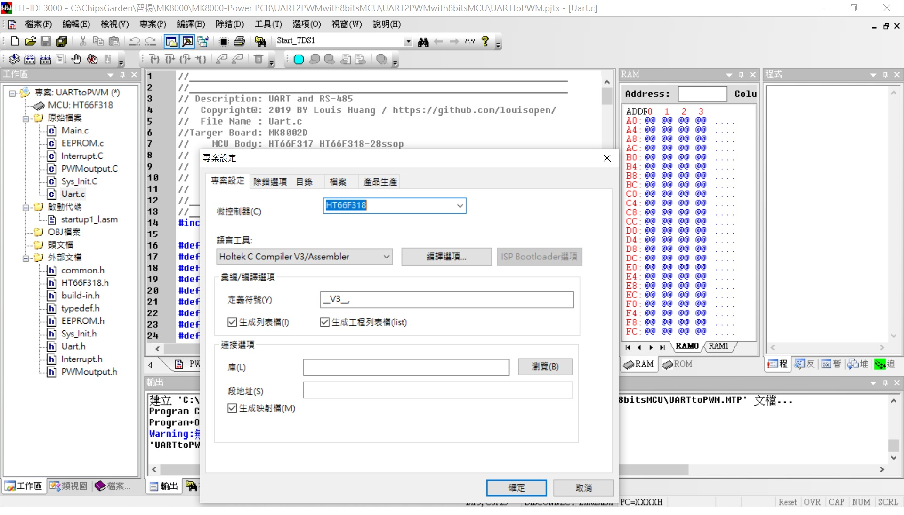
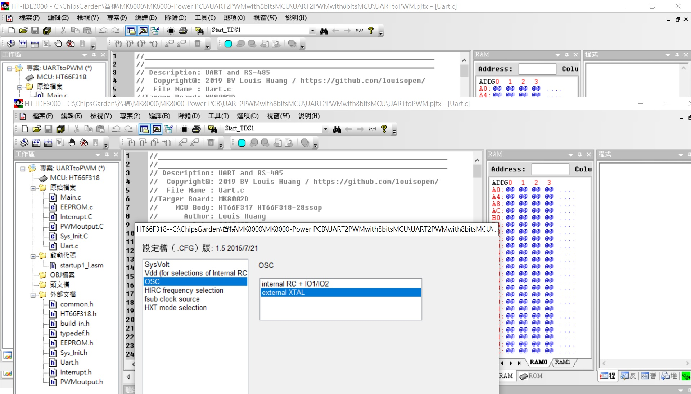
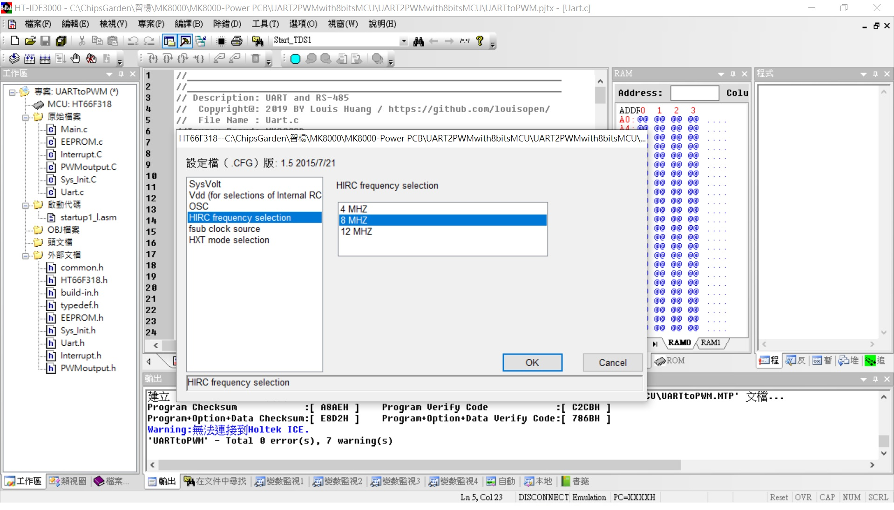
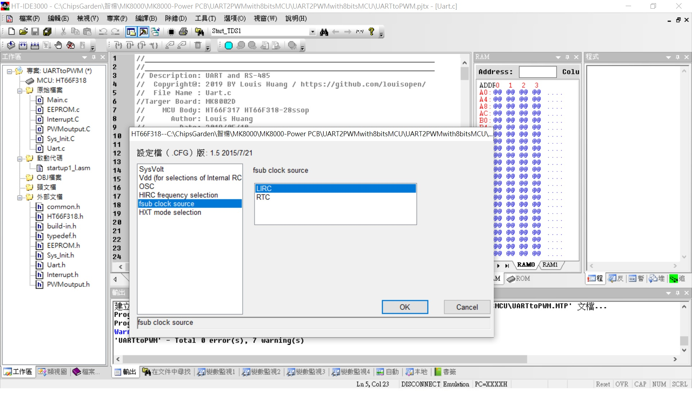
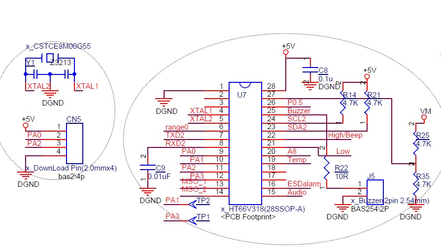

## ※UART2CAPTUREwith8bitsMCU
Useing HT66F318 UART access to GPIO, LED matrix, EEPROM, ADC, I2C...internal resource (Same RS-485 port) 
此專案利用PC軟件通過UART port下達指令以存取MCU內部的EEPROM(64bytes), ADC(8ch 12bits), PWM output(10bit), Capture... 
後續還可以持續增加I2C(Hi resolution adc), SPI(OLED display) 都透過UART port 

Baudrate: 9600,N,8,1 (協議格式參照RS-485通訊協議格式) 
ADC設置直接透過AN0~AN7讀取外部輸入,或AVDD,AVDD1/2,AVDD1/4讀取內部輸入 
Capture(HT66F317)設置TP1當輸入條件16bit+16bit counting 
Capture(HT66F318)設置TP1當輸入條件10bit+16bit counting 
Project Option: HXT; 可選項還有(小心使用)HXT,HIRC8M,HIRC12M,HIRC16M,LXT,LIRC

HT66F318 28ssop with HT-IDE3000 V8.02 & e-Link & e-WriterPro 
[HT66F318 Document](https://www.holtek.com.tw/search?key=ht66F318) 
[IDE3000 & ICE & Writer](https://www.holtek.com.tw/ice) 

### Relevant information
* HT-IDE3000 V8.02

* HOLTEK C Compiler V3/Assembly

* HT66F318 Config, used 8Mhz X'tal external, VDD/VDDA binding

* HT66F318 28ssop Diagram

### How to test or used
利用PC通訊軟件做為主動工具, 協議(9600,n,8,1), 格式比照RS-485格式(PC指令CRC用 A0 0A代替, MCU反饋的為CRC-16)

* For Example: 
* UART Formate(Get from MCU): 44 03 00 00 00 04 A0 0A   #讀取EEPROM位址0x0000,4組(共計8個bytes)
MCU return設計最大每次讀取四組(8byte) 所以反饋時: 44 03 08 00 01 02 03 04 05 06 07 CRC CRC

* UART Formate(Write to MCU): 44 06 00 0A EE FF A0 0A   #寫入EEPROM位址0x000A,資料為0xEEFF
MCU return: 44 06 00 0A EE FF CRC CRC

* UART Formate(Get from MCU): 44 03 03 00 00 02 A0 0A   #讀取Capture通道0, 1組4個bytes
MCU return Capture: 44 03 04 03 FF FF FF CRC CRC
MCU return Capture: 44 03 04 08 00 00 00 EC 97

### Other applications
* UART access to ADC converter(HY3118 24bit ADC) via I2C bus.
* UART access to OLED 16x2 display driver via SPI bus.

