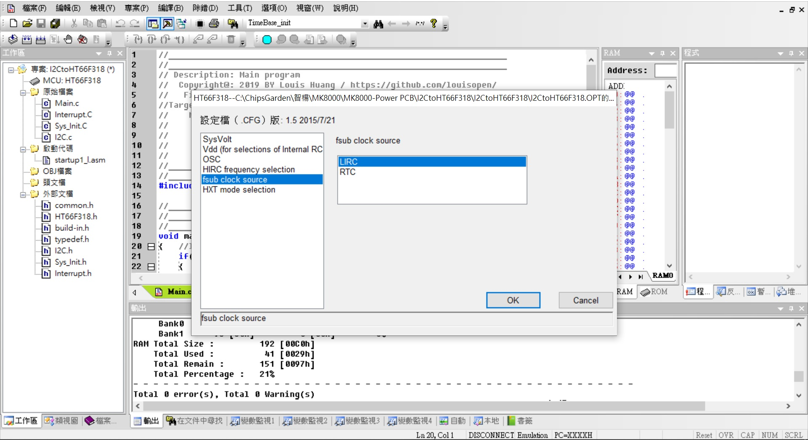

### UART2CAPTUREwith8bitsMCU
HT-IDE3000 V8.02  HT66F318 28ssop

Project Option可選擇:HXT,HIRC8M,HIRC12M,HIRC16M,LXT,LIRC 

Useing HT66F318 UART access to GPIO, LED matrix, EEPROM, ADC, I2C...(Same RS-485 driver)
此專案利用PC軟件下達指令以存取MCU內部的EEPROM(64bytes), ADC(8ch 10bits), PWM output(10bit), Capture... 
後續還可以持續增加I2C(Hi resolution adc), SPI(OLED display) 都透過UART 9600,N,8,1 協議格式參照RS-485通訊協議格式.

ADC設置直接透過AN0~AN7讀取外部輸入,或AVDD,AVDD1/2,AVDD1/4讀取內部輸入.

Capture(HT66F317)設置TP1當輸入條件16bit+16bit counting
Capture(HT66F318)設置TP1當輸入條件10bit+16bit counting

* HT-IDE3000 V8.02

* HOLTEK C Compiler V3/Assembly

* HT66F318 Config, used 8Mhz X'tal external, VDD/VDDA binding

* HT66F318 28ssop Diagram

#### How to test or used:
利用PC通訊軟件做為主動工具, 協議(9600,n,8,1), 格式比照RS-485格式(PC指令CRC用 A0 0A代替, MCU反饋的為CRC-16)

* For Example: 
* UART Formate(Get from MCU): 44 03 00 00 00 04 A0 0A   #讀取EEPROM位址0x0000,4組(共計8個bytes)
MCU return設計最大每次讀取四組(8byte) 所以反饋時: 44 03 08 00 01 02 03 04 05 06 07 CRC CRC

* UART Formate(Write to MCU): 44 06 00 0A EE FF A0 0A   #寫入EEPROM位址0x000A,資料為0xEEFF
MCU return: 44 06 00 0A EE FF CRC CRC

* UART Formate(Get from MCU): 44 03 03 00 00 02 A0 0A   #讀取Capture通道0, 1組4個bytes
MCU return Capture: 44 03 04 03 FF FF FF CRC CRC
MCU return Capture: 44 03 04 08 00 00 00 EC 97

#### Other applications:
* UART access to ADC converter(HY3118 24bit ADC) via I2C bus.
* UART access to OLED 16x2 display driver via SPI bus.

